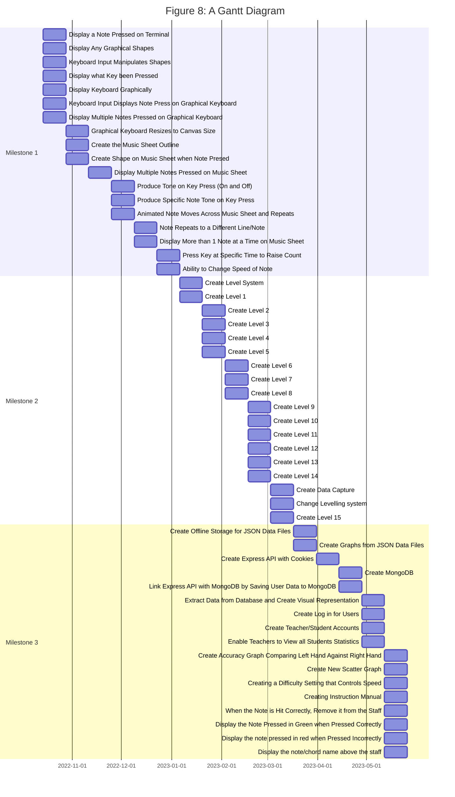

# Creating a Responsive and Dynamic Piano Education Tool

## Kieran Best

## Individual Project U10834

## Canterbury Christ Church University

## 2022/23

### Abstract

This project is aimed at creating a responsive educational tool to teach users how to play piano whilst simultaneously how to read sheet music; it will also create a visual representation of the user's learning progression from data collected from the user's input. This project will be completed using the agile framework, HTML5, CSS and JavaScript.

### Acknowledgements

I would like to give thanks to my supervisor, Allan Callaghan, for all his amazing support, guidance and patience throughout this project.

### Table Of Contents

- [Abstract](#abstract)
- [Acknowledgements](#acknowledgements)
- [Table Of Contents](#table-of-contents)
- [Introduction](#introduction)
- [Literature Review](#literature-review)
  - [How Do We Learn?](#how-do-we-learn)
  - [Importance of Sheet Music](#importance-of-sheet-music)
  - [Similar Applications](#similar-applications)
- [Requirements and Analysis](#requirements-and-analysis)
  - [Methodology](#methodology)
  - [User Stories](#user-stories)
  - [Objectives](#objectives)
    - [Milestone 1 Objective](#milestone-1-objective)
    - [Milestone 2 Objective](#milestone-2-objective)
    - [Milestone 3 Objectives](#milestone-3-objectives)
  - [Time Management Using Gantt](#time-management-using-gantt)
- [Design](#design)
  - [Conditional Flow Diagram](#conditional-flow-diagram)
  - [Hardware and Software Stack](#hardware-and-software-stack)
  - [Database Design](#database-design)
- [Implementation and Testing](#implementation-and-testing)
  - [Milestone 1](#milestone-1)
  - [Milestone 2](#milestone-2)
  - [Milestone 3](#milestone-3)
- [Results](#results)
  - [Challenges](#challenges)
    - [4th November 2022](#4th-november-2022)
    - [16th November 2022](#16th-november-2022)
    - [15th December 2022](#15th-december-2022)
    - [21st February](#21st-february)
    - [6th March](#6th-march)
    - [20th March](#20th-march)
    - [13th April](#13th-april)
  - [Findings](#findings)
  - [Goals Achieved](#goals-achieved)
  - [Further Work](#further-work)
  - [Conclusion](#conclusion)
  - [Evaluating the Project](#evaluating-the-project)
- [References](#references)
- [Appendices](#appendices)
  - [Meeting Notes](#meeting-notes)
    - [Friday 14th October](#friday-14th-october)
    - [Friday 21st October](#friday-21st-october)
    - [Friday 4th November](#friday-4th-november)
    - [Friday 18th November](#friday-18th-november)
    - [Friday 2nd December](#friday-2nd-december)
    - [Friday 16th December](#friday-16th-december)
    - [Friday 27th January](#friday-27th-january)
    - [Wednesday 8th February](#wednesday-8th-february)
    - [Wednesday 22nd February](#wednesday-22nd-february)
    - [Wednesday 8th March](#wednesday-8th-march)
    - [Wednesday 22nd March](#wednesday-22nd-march)
      - [Stakeholder Meeting](#stakeholder-meeting)
      - [Supervisor Meeting](#supervisor-meeting)

### Introduction

Trying to learn how to play piano can be a strenuous task, especially if you are unknowledgeable of how to read music. It has been understood that knowledge of sheet music can lead to a much more complex understanding of music (López‐Íñiguez & Pozo, 2014) and therefore can be vastly beneficial when learning how to play piano.
The aim of this project is to create an application that teaches users to how to read and play sheet music on a piano. The application will keep score on whether the user is hitting the note on time or not and adjust the speed and difficulty based on this and therefore is suitable for all demographics. It will then be able to visually represent the users educational journey and display key statistics from a period of time such as:

- Amount of times the hit note was correct
- Time difference between user pressed note and note needed to be pressed
- Amount of times note hit was incorrect due to various reasons

### Literature Review

#### How Do We Learn?

 Yuksel et al. (2016) explains we learn better when the our cognitive workload is above a certain level. and that this is hard to achieve through the use of videos. To meet the greatest level of education,  we must reach a “zone of proximal development”. This can be difficult due to underlying factors such as:

- Difficulty of the task
- Users’ cognitive ability
- Instructional design
- Users’ motivation

Intelligent Tutoring Systems (ITS) and Computer-Based Education (CBE) systems measure cognitive workload. 'ITS' tracks the psychological state of users in through student modelling  (Graesser, A.C. et al., 2012). Student modelling follows characteristics such as “subject matter knowledge, skills, motivation, and emotions.” ‘ITS’ “responds” to users states and adjusts the course, whereas human taught lessons follow a linear path (Graesser, A.C. et al., 2012). PLATO was an educational tool developed back in 1961 to teach by displaying information and then asking questions. It was used in WWII to train soldiers in new protocols in a cost efficient way. The expected response to these questions would be numerical, algebraic, words or phrases. It is taught in a linear method with no form of digression.
Lowe explained that within CBE also includes:

- Computer-Based Instruction (CBI)
- Computer-Aided Instruction (CAl)
- Computer-Managed Instruction (CMI)
- Computer-Based Training (CBT)
- CBI delivered on the Internet or intranet
- Internet-Based Training (IBT)
- CBI delivered by CD-ROM

These were developed by basic learning principles where Skinner (2012) investigated the development of reinforcing “theory to human learning”.

Progressing on from primarily educational tools, educational computer games have proven to be just as effective because of their ability to "increase students' motivation". It does this by allowing the user a fun experience as well as an educational 1 (Sampayo-Vargas, 2013). Zohaib (2018) explains that dynamic difficulty adjustment will adjust the difficulty based on the users "individual traits", factors including dexterity, learning and adapting ability, and emotional characteristics are measured to adjust the difficulty to avoid boredom for users. Much like that of our "zone of proximal development", Csikszentmihalyi (2009, cited in Zohaib, 2018) states that users travel through a "flow channel" as depicted in Figure 1.

> **Figure 1: Flow Channel**
>
> 
>
> *(Csikszentmihalyi, 2009, cited in Zohaib, 2018)*

The model is designed to avoid creating a difficulty too easy to cause boredom, and too hard to create frustration. It was proven by Hagelback and Johansson (2009, cited in Zohaib, 2018) that users prefer to be challenged at an accurate level that adapts to their styles and need.

While proving that educational computer games enhance a students enjoyment is not necessarily an accurate representation of the students learning, it has been proven that adaptive difficulty within educational settings increase the student's level of learning (Sampayo-Vargas et al., 2013). Sampayo-Vargas et al. explain that when comparing students progression with 3 different learning methods, adaptive difficulty proves to be more efficient than a steadily incremental difficulty game, and a written activity as seen in Figure 2.

> **Figure 2: Differences Between 3 Learning Techniques**
>
> 
>
> *(Sampayo-Vargas et al., 2013)*

As you can see, a linear increase in difficulty obtains the lowest score of 3.3, followed by 4.3 in a written activity. Whereas an adaptive difficulty obtains a much higher score of 7.0. This can again be iterated in Figure 3 where we take a much closer look at users progression of levels when comparing adaptive difficulty and linearly incremental difficulty.

> **Figure 3: Comparing Level Progression with Adaptive Difficulty and Linearly Increasing Difficulty**
>
> 
>
> *(Sampayo-Vargas et al., 2013)*

As you can see from Figure 3, a linear increase in difficult results in a gradual decline in correct responses, whereas an adaptive difficulty results in the correct responses staying in the upper percentile.

#### Importance of Sheet Music

Sight reading is the ability to read and play a piece of music unrehearsed, it is the performers ability to process "complex visual input (the score)" with minimal error (Kopiez and Lee, 2008). Having the ability to sight read sheet music can increase your skill as a musician in so many ways and "plays an important role in music education"(Chiu and Chen, 2012). Sight reading can

Not only is sight reading beneficial to you in terms of your musical ability but it can also be beneficial to all aspects of our lives. Musacchia and Khalil (2020) explain that musical training can give a multisensory workout and can help improve many things such as:

- Memory
- Attention span
- Reading ability
- Hearing
- Sight
- Social Awareness

Just like muscles, exercising your brain can cause it to become stronger, and the process of exercising your brain through activity is called neuro plasticity (Musacchia and Khalil, 2020). Neuro plasticity is where the brain becomes stronger in certain aspects of function. It has been proven that expert musicians have stronger than average brain power in auditory, visual and motor areas of the brain (Musacchia and Khalil, 2020).

Whilst playing an instrument is not only hugely beneficial for your brain in terms of cognitive function, it can also be beneficial for your mental well being..................

#### Similar Applications

Whilst there similar applications to the proposed, none have the exact features. ‘Simply Guitar’ and ‘Harmony City’ (Educational App Store, 2022) will teach you how to play a song. ‘Tenuto’, ‘Piano Notes Fun’ and ‘Note Trainer Pro’ which will teach you how to read music. These are all based on recordings and do not offer an interactive experience. This can be be detrimental to the users learning experience as explained previously.

‘P.I.A.N.O.’ has a interactive projection placed on to the keyboard to enable users to understand what key to push.

> **Figure 4: ‘P.I.A.N.O.’**
>
> 
>
> *(Rogers et al., 2014)*

As Rogers et al. (2014) explains, the mapping of the keys provides users with a way to learn how to read sheet music. This can often be the cause of putting off most people from learning how to play an instrument. Other benefits include teaching users where to place their hands to allow them to reach all the keys.  As well as “a note visualisation based on roll notation” which will teach timing (Rogers et al., 2014). The downfall for this application however, is even though it teaches hand placement for reading music, it does not teach how to read sheet music.

> **Figure 5: Note Visualisation in ‘P.I.A.N.O.’**
>
> 
>
> *(Rogers et al., 2014)*

Going back to learning in a zone of proximal development, Yuksel et al. (2016) created 'BACh'. An application where users’ cognitive workload dictates the applications difficulty. 'BACh' measures cognitive workload using a fNIRS sensor which is not in the scope of my project.

> **Figure 6: Learn Piano with ‘BACh’**
>
> 
>
> *(Yuksel et al., 2016)*

The most similar application to what I propose is ‘Synthesia’. An educational tool used with a MIDI keyboard for learning how to play piano by using of a note visualisation like that of ‘P.I.A.N.O.’. It contains a mass library of songs for the user to decide. And it also includes teaching where users hands should be to allow them full reach of keys. It also contains a feature “Finger Number Hints” in which users fingers are visually demonstrated (Synthesia Game, 2022). Whilst this is almost identical to my specification, this application does not adapt to users’ current ability and skill.

> **Figure 7: Finger Number Hints in ‘Synthesia’**
>
> 
>
> *(Synthesia Game, 2022)*

### Requirements and Analysis

#### Methodology

 The project will be created using an agile framework to support its development. The project be divided into 3 milestones each with demonstrations to users and the stakeholder to receive feedback and guidance. These milestones will be divided as such:

- September - January
- January - March
- March - May

Milestones will be divided into 2 weekly sprints and tasks will be assigned weights. Sprints will be based on the weights to determine how many tasks are to be completed each sprint.

Each Milestone will show logical steps in its production process whilst also giving clear deadlines for each sprint. It will be created using JavaScript, HTML5, CSS, Express and MongoDB.

#### User Stories

- As a user the application must demonstrate which key I am pressing and what note that is to begin with.
- As a user the application must allow me to clearly follow which note I need to press and when.
- As a user the application must clearly define if I’ve pressed the correct key or not.
- As a user the application must be a plug in and play application, and not require me to install multiple drivers to run.
- As a user the application must develop my understanding by progressing to a harder difficulty.
- As a user the application must be visually appealing.
- As a user the application must adjust its difficulty based on my current ability.
- As a user the application must produce a visual representation expressing my learning progression.
- As a user I want to be able to choose a difficulty setting that affects the speed.

- As a teacher the application must be able to produce a visual output that enables me to see how long each student has used the application as well as compare that against the students average hit percentage in a ascending or descending order.

#### Objectives

> Every Milestone Objective will have a number next to it displaying its difficulty as a weight.

##### Milestone 1 Objective

Create a Minimum Viable Product (MVP) and be able to produce it to potential users to attain feedback on usability and potential features.

- Display that a key has been pressed on the terminal - 1
- Display graphical shapes - 1
- Keyboard input manipulates shapes in some way - 2
- Display what Key been Pressed - 1
- Create keyboard - 1
- Keyboard input shows what key has been pressed on graphical keyboard  - 2
- Display multiple keys pressed on keyboard - 3
- Graphical keyboard resizes to canvas size - 1
- Create music sheet outline - 1
- Create shape on stave when note pressed - 1
- Display multiple keys pressed on stave - 3
- Produce tone on key press (note on and note off) - 1
- Produce specific key tone on key press - 2
- Note moves across stave and repeats - 3
- Note repeats to a different line/note - 2
- Display more than 1 note at a time - 1
- Press key at specific time to raise count - 2
- Ability to change speed of note - 1

##### Milestone 2 Objective

To create a level system that will slowly introduce users to how to play a keyboard.

- Create Level System - 2
- Create Level 1 - Right Hand, Without Moving Hand - 1
- Create Level 2 - Right Hand, Roll Up and Down 1 Octave - 1
- Create Level 3 - Right Hand, Random Notes Across 1 Octave - 1
- Create Level 4 - Right Hand, Roll Up and Down 1 Octave Including Sharps and Flats - 1
- Create Level 5 - Right Hand, Random Notes Across 1 Octave Including Sharps and Flats - 1
- Create Level 6 - Right Hand, Introduce 3 Note Chords in Order - 1
- Create Level 7 - Right Hand, Random Order of 3 Note Chords - 1
- Create Level 8 - Left Hand, Without Moving Hand - 1
- Create Level 9 - Left Hand, Roll Up and Down 1 Octave - 1
- Create Level 10 - Left Hand, Random Notes Across 1 Octave - 1
- Create Level 11 - Left Hand, Roll Up and Down 1 Octave Including Sharps and Flats - 1
- Create Level 12 - Left Hand, Random Notes Across 1 Octave Including Sharps and Flats - 1
- Create Level 13 - Left Hand, Introduce 3 Note Chords in Order - 1
- Create Level 14 - Left Hand, Random Order of 3 Note Chords - 1
- Create Data Capture - 1
- Adapt Levelling System to Suit Capturing Data - 1
- Create Level 15 - Play Simple Song Using Both Hands - 1

##### Milestone 3 Objectives

To produce visual aid in understanding the progression of a users' learning experience as well as include usability features.

- Create Offline Storage for JSON Data Files - 1
- Create Graphs from JSON Data Files - 2
- Create Express API with Cookies - 2
- Create MongoDB - 1
- Link Express API with MongoDB - 2
- Extract data from database and create visual representation - 3
- Create log in for users - 2
- Create teacher/student accounts - 2
- Create graph for teachers that allow teacher profile to view all students progress statistics aswell as comparison bar chart.
- Create accuracy graph comparing left hand against right hand.
- Create a scatter graph containing: - 1
  - Accuracy of pitch (%)
  - Accuracy of timing (%)
  - Duration of practice (minutes)
  - Accuracy of chords (%)
  - Number of perfect hits
- Create user interface features such as:
  - Creating a difficulty setting that would affect the speed in order to be more applicable to the younger or disabled audiences E.g. 'Easy', 'Medium' and 'Hard' buttons - 1
  - Creating an instruction manual for how to use the application - 1
  - When the note is hit correctly, remove it from the staff - 1
  - When the note is hit correctly, display the note pressed in green on both the visual keyboard and the staff - 1
  - When the note is hit incorrectly, display the note pressed in red on both the visual keyboard and the staff - 1
  - Display the note/chord name above the staff whilst moving across the screen - 1

#### Time Management Using Gantt



### Design

#### Conditional Flow Diagram

The flow of the application is controlled by the user input as all actions for the application are dependent on the MIDI device input:

- The sound comes from the note input being registered as a number from the MIDI device input.
- The visual representation on both the keyboard and the staff comes from the note number given by the MIDI device input.
- The difficulty is adjusted based on the users’ score.
- The visual output will be dictated by the user's input and accuracy.

> **Figure 9: Conditional Flow Diagram**
>
> 

#### Hardware and Software Stack

This application requires the user to possess a MIDI keyboard and the ability to plug into a computer or laptop device. The device will need to have a web browser that supports MIDI input such as Chrome, Edge, Firefox and Opera (caniuse, 2023).

#### Database Design


### Implementation and Testing

#### Milestone 1

To start creating this application, I had my initial proposal, to create a prototype application that will teach users how to play piano and read sheet music. So the objectives for milestone 1 were as follows:

- Create a graphical keyboard and show when notes have been pressed
- Create a visual staff and show when notes have been pressed
- Produce sound when notes are pressed
- Make notes move across the staff to depict when they need to be pressed
- Create a score system to track if the user presses the note correctly or not

To start off this application I first needed to create a basic HTML page with a canvas element. From here testing had to be implemented in the Script.js file in which the index page will output to its console if a MIDI device has been connected. If a device is connected then the MIDI device details will be displayed in the browser console.

```JavaScript
  // When the Midi device is first connected it will ask for permission to use MIDI device
  // and then display device features if successful
  if(navigator.requestMIDIAccess){
      navigator.requestMIDIAccess({sysex: false}).then(success, failure)
  }
  function success(midiAccess){
      midiAccess.addEventListener('statechange',updateDevices)
      const inputs = midiAccess.inputs;
      inputs.forEach((input) => {
          input.addEventListener('midimessage', handleInput)
      })
  }
  function failure(){
      console.log('Could not connect MIDI')
  }
  function updateDevices(event){
      console.log(`Name: ${event.port.name}, Brand: ${event.port.manufacturer}, State:${event.port.state}, Type:${event.port.type}`)
  }
```

> **Figure 10: Verification of MIDI Device Connected**
>
> 

From here basic input from the MIDI device needed to be registered and enable it to manipulate the canvas element. From here understanding which note had been pressed and display this on a graphical keyboard on the screen. Developing this until the user could press multiple keys and the notes would be displayed on a keyboard.

[View Completion of Visual Keyboard](https://github.com/KieranBest/Individual-Project/blob/d62134388a64e79a09bd9583056b95e7f6155fc0/script.js#L127)

From there ensuring the canvas is reactive to the users screen size, on both load up and resize of the browser window.

```JavaScript
  // Window starting gets the window statistics needed before creating keyboard
  window.onload = function(){
      keyboardStats();
      drawKeyboard();
  }

  window.onresize = function(){
      keyboardStats();
      drawKeyboard();
  }
```

The next stage was to create a staff and display the note pressed on the staff. This was difficult at first due to the numbers given to the note pressed by the MIDI device are programmed in a increasing order from left to right whereas the canvas element to draw the note is programmed in a decreasing order due to the canvas element height. This meant I had to create a function to convert the MIDI note number to a canvas height element.

```JavaScript
  // Draw on the staff when a note is pushed
  function staffNoteHit(staffNumber,notePressed,octave){
      if(majorKeyPos.includes(notePressed)){
          if(octave === 1){
              octaveWeight = (staffNumber*0.5+4)
          }else if(octave === 0){
              octaveWeight = (staffNumber*0.5+4)+3.5
          }else if(octave === 2){
              octaveWeight = (staffNumber*0.5+4)-3.5
          }
          ctx.beginPath()
          ctx.fillStyle="red"
          ctx.arc(hitNoteLine, octaveWeight*staffSpacing , staffSpacing*0.4, 0, 2 * Math.PI)
          ctx.fill()
      }
      else if(sharpKeyPos.includes(notePressed)){
          if(octave === 1){
              octaveWeight = (staffNumber*0.5+4)
          }else if(octave === 0){
              octaveWeight = (staffNumber*0.5+4)+3.5
          }else if(octave === 2){
              octaveWeight = (staffNumber*0.5+4)-3.5
          }
          ctx.beginPath()
          ctx.fillStyle="blue"
          ctx.arc(hitNoteLine, octaveWeight*staffSpacing , staffSpacing*0.4, 0, 2 * Math.PI)
          ctx.fill()
      }
  }
```

Multiple major notes being held is displayed in figure 11.

> **Figure 11: Multiple Major Keys**
>
> 

Multiple major notes with a sharp note being held is displayed in Figure 12.

> **Figure 12: Multiple Major Keys with a Sharp Key**
>
> 

Multiple sharp notes being held is displayed in figure 13.

> **Figure 13: Multiple Sharp Keys**
>
> 

After that, a keyboard produces sound so that was the logical next step. This was done by firstly creating an oscillator that produces a tone when any key is pressed and stopping the sound once the note is removed. After that calculating a frequency based on the note number to attain specific note tones. This was done by the following script:

```JavaScript
  window.AudioContext = window.AudioContext || window.webkitAudioContext
  let soundCTX

  const startButton = document.querySelector('button')
  const oscillators = {}

  startButton.addEventListener('click', () => {
      soundCTX = new AudioContext()
      startButton.style.display = 'none'
  })
  function midiToFreq(number){
      const a = 440; //Hz
      return (a/32) * (2 ** ((number - 9) / 12))
  }

  function noteOn(note, velocity){
      const osc = soundCTX.createOscillator()

      const oscGain = soundCTX.createGain()
      oscGain.gain.value = 0.33

      const velocityGainAmount = (1/127) * velocity
      const velocityGain = soundCTX.createGain()
      velocityGain.gain.value = velocityGainAmount

      osc.type = 'sine' //sine, square, triangle, sawtooth
      osc.frequency.value = midiToFreq(note)

      osc.connect(oscGain)
      oscGain.connect(velocityGain)
      velocityGain.connect(soundCTX.destination) // Connect the oscillator to speaker output

      osc.gain = oscGain

      oscillators[note.toString()] = osc
      osc.start()
  }

  function noteOff(note){
      const osc = oscillators[note.toString()]
      const oscGain = osc.gain

      // This stops the clicking sound when releasing the note due to the sine wave
      oscGain.gain.setValueAtTime(oscGain.gain.value, soundCTX.currentTime)
      oscGain.gain.exponentialRampToValueAtTime(0.0001,soundCTX.currentTime + 0.03)
      setTimeout(() => {
          osc.stop()
          osc.disconnect()
      }, 20)

      delete oscillators[note.toString()]
  }
```

The last part of milestone 1 was to create an animation displaying the required notes to be pressed as visual representation. Initially starting off with a simple animation of a single note displaying over a single line, and then progressing to multiple notes on a single line, and then to multiple notes over multiple lines using a random number generator to generate the element height of the note with an adaptable speed difficulty resulting in the following:

> **Figure 13: Note Animation**
>
> 

[View Completion of Milestone 1 Code Here](https://github.com/KieranBest/Individual-Project/blob/b078ba14acc521815c97ba47adf030f441f26e55/script.js#L408)

#### Milestone 2

At the beginning of milestone 2, I had my first meeting with my stakeholder to discuss the project and to determine the next steps of the application. We discussed:

- How the application was going to be adaptable to the user's ability and the most beneficial way the levels should progress. Creating that sense of responsiveness to how the user is playing and making it adaptive to the user's skill level. This would then create a more enjoyable experience for the user and would therefore lead to a more educational experience for the user.
- Usability features that could be implemented later on such as:
  - A similar feature to “Finger Number Hints” in "Sythesia" where the user can see which finger should be used for which note.
  - A feature that teaches users how to roll up and down the keyboard smoothly.
- The application could track the users progress and display it in a way that would be understandable and beneficial to the user.

It was decided that the levels in the application should have the flow depicted in Figure 14.

> **Figure 14: Level Flow**
>
> 

Most of my time in milestone 2 was creating the levelling system and how the application would navigate between levels. In order to do this, I created a class that contained every detail of all the levels. This was then accessed everytime the users score changed to determine whether the level needed to be increased or decreased. The full code for every level can be found [here](https://github.com/KieranBest/Individual-Project/blob/3d1d01a6edbadef9c1179c8599a80aac79286f39/DynamicDifficulty.js#L1)

If we take a look at levels 2-5 for example:

```JavaScript
  2:{ // roll up and down 7 notes to teach moving fingers correctly
    speed: 1,
    hitScreenPercentage: 0.1,
    recurringNotes:4,
    numberOfNotes: 1,
    requiredScoreToProgress: 25, // up and down twice
    requiredScoreToRegress: -10,
    down: true
    },
  3:{ // random majors in octave
    speed: 1,
    hitScreenPercentage: 0.1,
    recurringNotes:4,
    numberOfNotes: 1,
    trebleGeneratorSize: 7,
    requiredScoreToProgress: 20,
    requiredScoreToRegress: -15,
  },
  4:{ // roll up and down including sharps
    speed: 1,
    hitScreenPercentage: 0.1,
    recurringNotes:4,
    numberOfNotes: 1,
    requiredScoreToProgress: 22,
    requiredScoreToRegress: -20,
    down: true,
    sharp:false
  },
  5:{ // random notes including sharps
    speed: 1,
    hitScreenPercentage: 0.1,
    recurringNotes:4,
    numberOfNotes: 1,
    sharpChance: 0.33,
    requiredScoreToProgress: 20,
    requiredScoreToRegress: -20
  },
```

We can see that the score required to progress to the next level is different due to the level requirements, level 2 needs 25 correct notes because when you roll up and down an octave (7 notes) twice, there are 25 keys to push. Whereas level 4 has 22 because rolling up and down an octave once gives 22 notes. The score required to regress increases as the user progresses through the levels due to the complexity of levels increasing. This allows a larger margin of error and allows the users score to be able to fluctuate in the distance between score requirements.

To understand how the application works it is important to understand the variables within this 'DynamicDifficulty' class, the speed is adjustable for all levels, however I decided to keep it at 1 due to increasing the speed in which notes move across the screen can add even more difficulty which I felt was unnecessary at the time. The 'hitScreenPercentage' is the percentage of the screen that the user is able to press the note and it be considered correct. This is worked out by 2 invisible lines either side of the 'hitMarker' called the 'lowerBoundary' and 'upperBoundary'. If the note required ('this.x') reaches between these boundaries then the note is considered correct.

```JavaScript
  lowerBoundary = hitMarker-((window.innerWidth*DynamicDifficulty[difficultyLevel].hitScreenPercentage)/2)
  upperBoundary = hitMarker+((window.innerWidth*DynamicDifficulty[difficultyLevel].hitScreenPercentage)/2)

  if(this.x > lowerBoundary && this.x < upperBoundary)
```

'recurringNotes' only changes when progressing from level 1 to 2, and 14 to 15. This is due to the same reason as changing the speed, in order to ensure that the application is applicable to a wide range of audiences, it is important to not drastically change the difficulty every time the level changes. 'numberOfNotes' is the number of notes that are required at any 1 moment, this is the difference between a single note, or a chord which are only implemented in levels 6, 7, 13 and 14. These chord requirements use the same system as accessing the difficulty, a chord class that contains all chords and their note details. This can be found [here](https://github.com/KieranBest/Individual-Project/blob/3d1d01a6edbadef9c1179c8599a80aac79286f39/Chords.js#L1).

```JavaScript
  const trebleChords = {
    1:{ // a Major  (A) A - C# - E
      1: [4, "major"],
      2: [3, "sharp"],
      3: [2, "major"]
    },
    2:{ // a minor (Am) A - C - E
      1: [4, "major"],
      2: [3, "major"],
      3: [2, "major"]
    },
```

The first number is the 'trebleChords' object that is used to access the chord values, the value of that object is another object that contains the note number as the key and an array as the value. Within the array the first number in the location on the staff the note will be displayed and the second value is the type of note, major or sharp.

Levels 2 and 4 contain a boolean key named 'down' that depicts whether the flow of notes is going up or down the octave and is determined within the 'animatingNotes' class as seen below.

```JavaScript
  case 2: // roll up and down 7 notes to teach moving fingers correctly
    this.y = staffSpacing * cycleNotes
    this.major = true
    if(DynamicDifficulty[2].down == true){ // Scrolls up and down through the octave
      cycleNotes=cycleNotes+0.5
      if(cycleNotes>3.5){
        DynamicDifficulty[2].down = false
        }
      }
      else if (DynamicDifficulty[2].down == false){
        cycleNotes=cycleNotes-0.5
          if(cycleNotes<1.5){
            DynamicDifficulty[2].down = true
          }
        }
      this.image = noteImage
      break
```

The only difference between levels 2 and 4 is that in level 4, sharp notes have been introduced and therefore the rolling implementation has been adapted to include an 'if' statement to determine whether the note contains a '#' in the name. In level 5, 'sharpChance' is introduced, this is a float value that determines the chance of a sharp note appearing. This is implemented by whether a random number generator is more than the 'sharpChance' value, if it is then the note is a major and the image produced for that note is represented as as. If it is less than 'sharpChance' then the note is a sharp and the image produced is represented as so.

```JavaScript
  let trebleSharpValue
  if(Math.random()>DynamicDifficulty[5].sharpChance){
    this.image = noteImage
    this.major = true
    this.y = trebleValues[Math.floor(Math.random() * 7)+1] * staffSpacing
  }
  else{
    this.image = sharpImage
    this.major = false
    trebleSharpValue = Math.floor(Math.random() * 7)+1
    if(trebleSharpValue == 2 || trebleSharpValue == 3.5){
      trebleSharpValue ++
    }
    this.y = trebleValues[trebleSharpValue] * staffSpacing
  }
```

Once levels 1-7 were created, creating levels 8-14 were pretty straight forward as the values portraying the height of required notes on the staff just needed to be adapted to change the notes from treble to bass which proved much simpler than originally intended.

After that, creating a system to capture data was the next task, capturing user data to understand how the user plays and be able to view common trends would be extremely beneficial for the user to understand how they can improve. I decided to do a nested object for the user's data capture. Every time the user pressed a note, the application would store a large collection of data, this included:

```JavaScript
  const noteNumberProgression = {
    expectedHitTime: currentExpectedHitTime,
    actualHitTime: currentActualHitTime,
    differenceInHitTime: currentActualHitTime.time-currentExpectedHitTime.time,
    noteoff: noteOffTime,
    timeHeldNote: noteOffTime.time - currentActualHitTime.time,
    correctNote: correctNoteHit,
    correctYHit: this.yHit,
    correctY1Hit: this.y1Hit,
    correctY2Hit: this.y2Hit,
    major1: this.major,
    major2: this.major1,
    major3:this.major2,
    hand: leftOrRight,
    noteEntered: octaveWeight,
    noteRequired: (this.y/staffSpacing)+0.5,
    noteGapBetweenEnteredAndRequired: octaveWeight-((this.y/staffSpacing)+0.5),
    previousNoteRequired: previousNote,
    distanceBetweenPreviousNoteRequiredAndCurrentRequired: distanceBetweenNotes,
    noteNumberInGame: noteNumberInGame,
    missedNote: missedNote,
    deductionReason: deductionReason,
    deductionCode: deductionCode,
    withinExtraBoundary: this.bonusScore
  }
```

Then every time the user level increased or decreased, the details of that level along with every note collection would be stored such as:

```JavaScript
  gameProgression[levelProgression]={
    currentLevel: difficultyLevel,
    numberOfNotes: DynamicDifficulty[difficultyLevel].numberOfNotes,
    recurringNotes: DynamicDifficulty[difficultyLevel].recurringNotes,
    hitScreenPercentage: DynamicDifficulty[difficultyLevel].hitScreenPercentage,
    requiredScoreToProgress: DynamicDifficulty[difficultyLevel].requiredScoreToProgress,
    requiredScoreToRegress: DynamicDifficulty[difficultyLevel].requiredScoreToRegress,
    numberofNotesinLevel: numberOfNotesInLevel,
    userNoteProgression: userNoteProgression
  }
```

The final task for Milestone 2 was to be able to play a simple song that uses both hands, to enable the user to bring together everything they have learnt and combine both hands to play. The idea of this stage of the application is to again start simple and not overload the user, therefore the song 'Happy Birthday' was chosen due to it only user single notes on both treble and bass. The future development of this project would see the addition of more complex songs that use chords.

#### Milestone 3

Before meeting with the stakeholder I felt it would be suitable to demonstrate different ways in which the data can be visualised and attain feedback and further suggestions. So I created some ideas of graphs using 'chart JS' (Line Chart, 2023)(Doughnut and Pie Charts, 2023) with my data as can be seen below:

> **Figure 15: Actual Vs Expected Hit Times**
>
> 

In figure 15, the black line, depicts a baseline of when the user should hit the note, the red line depicts when the user actually hit the note. If the red line is above the black, it means they hit it late, if it is below it was early.

> **Figure 16: Note Traits Overall**
>
> 

In figure 16, we can see overall statistics of how many times the user:

- Pressed the correct note
- Pressed the wrong note
- Pressed the wrong amount of notes
- Pressed the note either too early or too late
- Missed the note

In the 3rd and final milestone, it was decided after stakeholder feedback that not only the user being able to identify key areas of improvement using visual aid, but also for a teacher to be able to view all students progress and data visually. This would allow the teacher to identify key areas of improvement for each student. This would be done by creating a teacher login and a student login, the teacher would be able to view all students progress and the student would be able to view their own individual progress. Among other feedback, it was also explained that it may be more beneficial to measure some statistics against how much time the user has used the application, rather than the number of notes they have played. This would allow for a more accurate representation of the user's progress as my stakeholder explained, the more time you spend learning piano, the better you will become. It was also suggested to create features such as:

- A new scatter graph comparing:
  - Accuracy of pitch (%)
  - Accuracy of timing (%)
  - Duration of practice (minutes)
  - Accuracy of chords (%)
  - Number of perfect hits
- Usability buttons that enable the user to manually change the speed if they find the current setting to fast or slow
- Create an instruction manual upon opening the application to explain how it works and how to gain the most from it
- Change features on the animation of the staff to depict whether the user hit the note correctly or not, such as a green indicator for correct and red for incorrect
- Display the name of the note required moving along in the animation above the staff

Due to the amount of feedback and suggestions for the 3rd milestone, and being able to see this in the gantt chart [here](#time-management-using-gantt), it was not possible for me to complete all of the [objectives](#milestone-3-objectives). I created the MongoDB and created a connection using an Express Server, changing the application to a client server model using a MERN stack, however that is as far as I got due to unforeseen circumstances both academically and personally. You can see how I tried to overcome my academic issues [here](#13th-april).

### Results

#### Challenges

##### 4th November 2022

A bug appeared that when you click both a sharp key and a major key and remove the major key the sharp key should stay lit up on the visual keyboard, however when removed it returned the sharp key to the original colour despite still holding it. This was fixed by creating an if statement with 2 variables, 1 for the sharp key and 1 for the major key. This allowed for the sharp key to stay lit up when the major key was removed and vice versa.

[View Fix Here](https://github.com/KieranBest/Individual-Project/blob/d62134388a64e79a09bd9583056b95e7f6155fc0/script.js#L127)

##### 16th November 2022

Following the previous bug, when multiple sharp keys are pressed the last 1 pressed stays lit up, however previous sharp keys are overwritten. Trying to fix this bug by clearing the canvas to avoid the build up of "residue" of lines on the canvas and redisplay the held notes broke multiple functions and caused new bugs. This included:

- Correct placement for notes displayed on the staff.
- Correct number of notes pressed displayed on the staff.
- Bug in which the octaves are causing a new staff key press circle to appear when no key is pressed.
- Pressing sharp keys deletes the visual keyboard.
- Pressing major keys is not displayed on the visual keyboard.

The initial bug took much longer to fix than anticipated and was eventually fixed by creating a new array to store sharp notes along with numerous 'if' statements to check if the note is a major or sharp, as well as if any notes are in the 'heldNoteList' array.

[View Fix Here](https://github.com/KieranBest/Individual-Project/blob/d1e0c7baa5195c09c53deece297949a013ec3b5e/script.js#L95)
[View Fix Here](https://github.com/KieranBest/Individual-Project/blob/d1e0c7baa5195c09c53deece297949a013ec3b5e/script.js#L288)

##### 15th December 2022

Trying to create a successful flow for the notes across the screen has proved harder than intially thought, the while monitoring the fps it appears to alter slightly when new notes are added to the screen, therefore creating an average fps based on 1000 frames seems to have fixed the problem.

[View Fix Here](https://github.com/KieranBest/Individual-Project/blob/2c1641df990d89f15e4e1baae9ae6fd9a602f3dc/script.js#L495)

##### 21st February

When saving user data for statistical analysis it has become apparent that when changing level the notes on the previous level are still displayed but are recorded as the next level. For example, when progressing from a single note level to a chord level, the single notes are recorded in the chord levels statistics.

Scoring was fixed by accessing the number of notes required and accessing whether 'notesHeldList' array contained the required notes.

[View Fix Here](https://github.com/KieranBest/Individual-Project/blob/07ff64c7daeefd05153f44195ea2733348d7a717/script.js#L482)

##### 6th March

When creating the 15th level, the problem with trying to make it an actual song was that:

- The application uses a oscillator to create the sound, so the sound is never going to be pitch perfect unless I go through and change the frequency of each note. Which is do able, except it would take further time to do so that I do not have for this project. This could go down as a future development idea, to change the sound produced to use actual piano sounds.
- The frame rate for my monitor is different to other monitors, and that is what is used to create the movement of the notes across the screen. Therefore the song will have a different speed on different monitors, which I am unaware of how to fix at this moment in time. Whilst this is detrimental to the user experience, this application is just a prototype and had I known this would affect me when I created the animation for the notes, I would have researched into a better method for creating the animation.

##### 20th March

When creating a pie chart it was perfect if the user chooses the pie chart graph first, however if the user chose either of the others the pie would then become a doughnut graph.

```JavaScript
const myChart = new Chart(
  document.getElementById('myChart'),
  config
)

 myChart.data.labels = ['Number Of Correct Hits','Number Of Wrong Hits','Number Of Wrong Number Hits',
    'Number Of Out Of Bound Hits','Number Of Missed Notes']
  myChart.data.datasets[0].label = ""
  myChart.data.datasets[0].data = [numberOfCorrectHits,numberOfWrongHits,numberOfWrongNumberHits,numberOfOutOfBoundHits,numberOfMissedNotes]
  myChart.data.datasets[0].backgroundColor = [
    'red',
    'blue',
    'yellow',
    'green',
    'black'
  ]
  myChart.data.datasets[0].borderColor = [
    'red',
    'blue',
    'yellow',
    'green',
    'black'
  ]
  myChart.update()
```

This was because it was still storing the other datasets used to create the other graphs, to rectify this I initially used the pop() function

``` Javascript
  myChart.data.labels.pop()
  myChart.data.datasets.forEach((dataset) => {
    dataset.data.pop()
  })
  ```

However when more than 1 dataset existed, this did not fix the bug. Therefore the fix was to set the length of the dataset to 0 or 1 depending on the type of graph being displayed and then reinstate a dataset using the required data.

[View Fix Here](https://github.com/KieranBest/Individual-Project/blob/b500183ec3c41f0e1323456b9165090d564846d4/dataAnalysis.js#L101)

##### 13th April

Trying to create a server linking to a client by following tutorials such as those listed below, I could still not get the posting to work properly. Querying this online, it was suggested to use 'Postman' to test http requests, however on doing so it would return a 401 error with a 'POST' request. Without a successful 'POST' request working, I could not Due to this and a combination of time restraints due to personal life commitments, I was unable to complete most of Milestone 3's objectives.
  https://www.youtube.com/watch?app=desktop&v=084rmLU1UgA&t=239s
  https://www.youtube.com/watch?v=SqcY0GlETPk
  https://learning.postman.com/docs/introduction/overview/
  https://www.youtube.com/playlist?list=PL4cUxeGkcC9h77dJ-QJlwGlZlTd4ecZOA
  https://community.postman.com/t/how-to-resolve-error-401-unauthorized-in-postman/17318/5

#### Findings

Throughout this project 1 thing that has become apparent is that creating a timeline of sprints is not always accurate due to an inability to comprehend the difficulty of said task. For example creating a level system had originally been anticipated to hold a weighted value of 2, however this task only took 20 minutes to successfully implement. Whereas being able to press multiple keys and releasing only 1 caused multiple problems in various scenarios such as:

- Multiple major keys
- Multiple sharp keys
- Mixing major and sharp keys
- Multiple keys being displayed on the visual keyboard
- Multiple keys being displayed on the staff
- Scoring for multiple keys
- Documenting wrong notes pushed when 1 or more notes pressed does not much notes required for chords

A very important lesson I learned not only from myself, but from my peers is that having a structured work time for this project benefited me greatly, and I could see the difference in my project compared to my peers because I had my 'project day'. I planned from the beginning to work on this project every Wednesday, and I did that religously. From having that structure I was able to fulfill the majority of my research and create a very basic prototype for my project in the first semester ready for the presentation in January. This put me in good stead for the rest of the project, and set me in my way that I can achieve a lot more than I thought capable in a short space of time. This structure also proved excellent in terms of motivation, I looked forward to my project day every week was excited to implement further features and see my progress.

**present all the results (products, experimental findings, theories, etc.) generated during the project. This may also include some off-topic findings that were not expected, or which were side-effects of other explorations.**

#### Goals Achieved

I am proud to say that by the end of the 1st milestone I successfully had a working prototype for the poster presentation in January, I confidently showcased my project in the presentation, being able to express all aspects of the project and how I planned to achieve them. Even using my research to back up conscious choices I have made for this project and potential features that could be implememented in the future.

By the end of the 2nd milestone I had created an application that was able to adapt to the users ability and alter the difficulty in order to keep the user in the "zone of proximal development". It was

When starting this project it was apparent that there would always be room for further improvement, but the scope of the project and how vast it could become was beyond what I could have imagined before this project began. Initially my scope of the project was to create a teaching tool that could be used either in classrooms or personal use, to teach users how to play piano and read sheet music. And since then it has greatly progressed from suggestions from my supervisor, stakeholder and personal research conducted on similar applications and now has features that I hadn't ever considered. Features such as:

- Adaptive difficulty
- Extensive levelling system on a simple progression of difficulty
- Data storage for users progression
- Visual representation of users progression

Whilst I feel a great achievement for what I have achieved, how I planned this project, and how I executed it with strict time management. I feel I did not succeed in this project due to the final milestone of this project. Had I better planned the extent of this project I would've planned to create the database and account system at the beginning of this project as I believe it is the most complex part of my project and should've been treated as the most important.

**describes the degree to which the findings support the original objectives laid out for the project. The goals may be partially or fully achieved, or exceeded. Note that reporting of failures to achieve goals is important since a fundamental feature of the assessment procedures is that the processes (how you went about your project) are often as important as the products of the project.**

#### Further Work

Due to the time constraints and complexity of this project, there are many features that I did note have time to implement that were suggested by my stakeholder such as:

- Creating a log in system for both teachers and students
- Connecting to a database to:
  - Store user data
  - Retrieve user data
- Enable teachers to:
  - View an overview of all students progress in 1 graph
  - Select specific students and view their progress
- Demonstrating correct fingers on notes
- Correct hand movements to reach notes
- Display of current note required to hit
- Creating accounts to enable:
  - Teachers to view all students progression
  - Students to log in and use the application from any device
- New graphical analysis such as:
  - Scatter graph containing:
    - Accuracy of pitch (%)
    - Accuracy of timing (%)
    - Duration of practice (minutes)
    - Accuracy of chords (%)
    - Number of perfect hits
  - Accuracy graph comparing left hand against right hand
- Adjustable difficulty to determine starting speed, this could be represented as buttons initially, and progressed into an adjustable scale
- An initial index page that contains user instructions and how to work the application
- Enable the note required to disappear once the user hits the note with a colour marker of green when correct and red when incorrect

As are there many features I would've liked to have implemented to make this a much more realistic prototype such as:

- Adding to the levelling system more levels that included more complex songs
- Implement an achivements system, for example, achieving a 95% pass rate earns a badge or achievement
- Adding a social side to the application that would enable users to attain feedback from their teachers as well as show off their achievments to their class mates
- Creating a leaderboard with different attributes such as:
  - Most time spent practicing
  - Most perfect hits in a row
  - Highest accuracy (%)

**describes 2 things: firstly, new areas of investigation prompted by developments in this project, and secondly parts of the current work which were not completed due to time constraints and/or problems encountered.**

#### Conclusion

**The conclusions can be summarised in a fairly short chapter (2 or 3 pages). This chapter brings together many of the points that you will have made in other chapters, especially in the previous results and discussion chapter. Do not be afraid of repeating some of your earlier statements here, albeit using different wording.**

#### Evaluating the Project

**Evaluation for this project will be done through comparison of the initial specification and design documents against the finalised project. It will also look at each sprint to see if targets were completed on time and to the expected standard.**

### References

Caniuse (2023) [caniuse.com](https://caniuse.com/?search=midi) (Accessed: 23/03/2023)

Line Chart (2023)[Chart.js](https://www.chartjs.org/docs/latest/charts/line.html) (Accessed: 1/03/2023)

Doughnut and Pie Charts(2023)[Chart.js](https://www.chartjs.org/docs/latest/charts/doughnut.html) (Accessed: 1/03/2023)

Chiu, S.C. and Chen, M.S. (2012) December. A study on difficulty level recognition of piano sheet music. 2012 IEEE International Symposium on Multimedia, pp. 17-23.

Educational App Store (2022) [Best Apps to Learn Music](https://www.educationalappstore.com/app-lists/best-apps-music-learning)(Accessed: 18/11/2022)

Graesser, A.C. et al.(2012) Intelligent tutoring systems. APA educational psychology handbook, 3:(Application to learning and teaching), pp. 451-473.

Kopiez, R. and In Lee, J. (2008) Towards a general model of skills involved in sight reading music. Music education research, 10(1), pp.41-62.

López‐Íñiguez, G. and Pozo, J.I. (2014) The influence of teachers’ conceptions on their students’ learning: Children's understanding of sheet music. British Journal of Educational Psychology, 84(2), pp.311-328.

Lowe, J. (2001) Computer-base education: Is it a panacea? Journal of Research on Technology in Education, 34(2), pp. 169-171.

Musacchia, G. and Khalil, A. (2020) Music and Learning: Does music make you smarter. Frontiers for Young Minds, 8

Rogers, K. et al. (2014) P.I.A.N.O.: Faster Piano Learning with Interactive Projection. Proceedings of the Ninth ACM International Conference on Interactive Tabletops and Surfaces, pp. 149-158.

Sampayo-Vargas, S., Cope, C.J., He, Z. and Byrne, G.J. (2013) The effectiveness of adaptive difficulty adjustments on students' motivation and learning in an educational computer game. Computers & Education, 69, pp.452-462.

Skinner, B. (2012) The science of learning and the art of teaching. Reading in Educational Psychology, 66, pp. 301.

Synthesia (2022) [Synthesia Game](https://synthesiagame.com/) (Accessed: 18/11/2022)

Yuksel, B.F. et al. (2016) Learn piano with BACh: An adaptive learning interface that adjusts task difficulty based on brain state. Proceedings of the 2016 chi conference on human factors in computing systems, pp. 5372-5384.

Zohaib, M. (2018) Dynamic Difficulty Adjustment (DDA) in computer games: A review. Advances in Human-Computer Interaction, 2018

### Appendices

#### Meeting Notes

##### Friday 14th October

Meeting with supervisor to confer about project scope and initial starting point:

- Understand basic MIDI Input [example](https://github.com/superLimitBreak/webMidiTools/blob/master/webMidiLog.html)
- Gain understanding in HTML5 canvas

##### Friday 21st October

Meeting with supervisor to gain insight into oscillator type as well speaking about key press event registering. Also created a rough order of objectives for the required features:

- Input from keybord to terminal
- Draw graphical shapes
- Keyboard input manipulates shapes in some way
- Convert key pressed intp human readble form
- Algorithum to draw graphcally draw keyboard with shapes
- Keyboard input updates graphicsal keyboard with keys pressed (multiple keys if needed)
- Keyboard resizeable to canvas
- Draw sheet stave? Trebble cleff?
- Draw note on stave when key pressed
- Produce tone on key press (note on and note off)
- Actual note played on key press
- Note moves across stave (repeat)
- Note repeats on differnt notes/lines?
- Can change speed of notes (recompile?)
- Press key at right time, raise show count
- Display more than 1 note at a time

Supervisor’s help to explain potential method of obtaining individual input note value: note value, octave, note letter etc.

> Supervisor’s Help 1
>
> 

Supervisor’s help to explain creating musical note along with potential ideas for drawing keyboard.

> Supervisor’s Help 2
>
> 

##### Friday 4th November

Meeting with supervisor to discuss progress and making visible keyboard and staff dynamic and adapt automatically to the change of the screen size.

##### Friday 18th November

Meeting with supervisor to discuss documentation and areas needed for improvement such as:

- Conciseness of writing
- Objectives
- Format of document

##### Friday 2nd December

Meeting with supervisor to discuss mark scheme, and introduce a JavaScript method called "requestAnimationFrame()" used to create moving animations.

[Request Animation Frame](http://www.javascriptkit.com/javatutors/requestanimationframe.shtml)

[Supervisor Example for RequestAnimationFrame](https://github.com/calaldees/paratrooper/blob/1dc2ddf1c47ab4728c78d8947ec04d57a00a500d/index.html#L984)

##### Friday 16th December

Meeting with stakeholder to discuss project and attain valuable feedback as to the progress of the current prototype. Discuss potential features and come up with steps for the next milestone. New objective for the following milestone was to create the level system with the following descriptions:

- Dominant Hand, Without Moving Hands
- Dominant Hand, Move Hand Across 1 Octave
- Dominant Hand, Introduce Sharps and Flats in the Octave
- Dominant Hand, Introduce 3 Note Chords
- Swap to Less Dominant Hand, Without Moving Hand
- Less Dominant Hand, Move Hand Across 1 Octave
- Less Dominant Hand, Introduce Sharps and Flats in the Octave
- Less Dominant Hand, Introduce 3 Note Chords
- Play Across Both Hands
- Play Across Both Hands, Introducing New Chords
- Play Across Both Hands

##### Friday 27th January

Feedback from poster presentation allowed potential users to give direct feedback with potential features, will discuss with stakeholder to attain approval for prospective features.

##### Wednesday 8th February

Meeting with supervisor to provide guidance to implement feature that collects user data as this will be very beneficial for milestone 3.

##### Wednesday 22nd February

Meeting with supervisor to discuss potentials for data to be captures and next steps in planning and research for next milestone. This includes:

- Graph Charts
- Functions such as:
  - filter()
  - map()
  - reduce()
- Offline storage and how that can be progressed to a Rest API

##### Wednesday 8th March

Meeting with supervisor to discuss heading for Milestone 3, basic steps and current progression on Milestone 3.
Basic guidelines include to use gitpod to create a express API connected with mongoDB.

##### Wednesday 22nd March

###### Stakeholder Meeting

Meeting with stakeholder to progress of project. Demonstrated current working prototype along with demonstrations of graphs produced. The stakeholder expressed great interest in the graphs produced, however stated the method of measurement should be changed against number of notes hit overall to a percentage of all notes hit. Along with changing names of current graphs produced. She produced some ideas of graphs to create such as:

- Accuracy with left hand against accuracy against right hand.
- A scatter graph containing:
  - Accuracy of pitch (%)
  - Accuracy of timing (%)
  - Duration of practice (minutes)
  - Accuracy of chords (%)
  - Number of perfect hits

Stakeholder expressed how viewing every single period of play could become problematic and overcomplicated to view, so dividing it into weeks and being able to select an amount of weeks or some form of selective capability could make viewing large amounts of data less complex.

A feature that the stakeholder thought would be excellent would be to create a way for a teacher to view all students progress in 1 page, to enable a bar graph to be produced to see every students average hit against the amount of time they have practised in 1 graph. This graph could be arranged in ascending or descending order to make it easier to identify the less encouraged students.

Many user interface features were brought up such as:

- Creating a difficulty setting that would affect the speed in order to be more applicable to the younger or disabled audiences.
- Creating an instruction manual for how to use the application.
- When the note is hit correctly, remove it from the staff.
- When the note is hit correctly, display the note pressed in green on both the keyboard and the staff.
- When the note is hit incorrectly, display the note pressed in red on both the keyboard and the staff.
- Display the note/chord name above the staff whilst moving across the screen.

###### Supervisor Meeting

Meeting with supervisor to discuss creating the API and different types of Docker systems. Also guidelines on where to get information on how to create the Express API.

[Supervisor Example for Using MongoDB](https://eur01.safelinks.protection.outlook.com/?url=https%3A%2F%2Fgithub.com%2Fcalaldees%2FTeachProgramming%2Ftree%2Fmaster%2Fteachprogramming%2Fstatic%2Fprojects%2Fdata%2Fmongo&data=05%7C01%7Ck.best806%40canterbury.ac.uk%7C2e54a99d71b349707fbe08db2b831677%7C0320b2da22dd4dab8c216e644ba14f13%7C0%7C0%7C638151614242327608%7CUnknown%7CTWFpbGZsb3d8eyJWIjoiMC4wLjAwMDAiLCJQIjoiV2luMzIiLCJBTiI6Ik1haWwiLCJXVCI6Mn0%3D%7C3000%7C%7C%7C&sdata=eNuRlF7BUikr5ALIAT3XUWFJfIzdfDLI3sidgk7Lx2Q%3D&reserved=0)

[Supervisor Example for using Multi Container System](https://eur01.safelinks.protection.outlook.com/?url=https%3A%2F%2Fgithub.com%2Fcalaldees%2FdockerWorkshop%23multi-container-systems&data=05%7C01%7Ck.best806%40canterbury.ac.uk%7C2e54a99d71b349707fbe08db2b831677%7C0320b2da22dd4dab8c216e644ba14f13%7C0%7C0%7C638151614242327608%7CUnknown%7CTWFpbGZsb3d8eyJWIjoiMC4wLjAwMDAiLCJQIjoiV2luMzIiLCJBTiI6Ik1haWwiLCJXVCI6Mn0%3D%7C3000%7C%7C%7C&sdata=vBuaJgvqbYnACNIEkhRO5HgH9XVNnpiMowGgd9CQ2Uk%3D&reserved=0)
